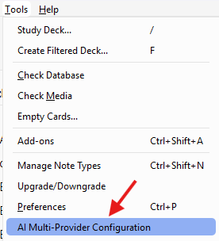
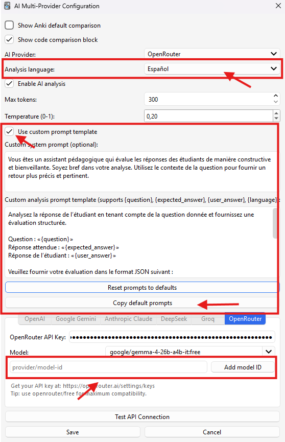

# Score Answer AI for Anki

AI-powered semantic evaluation for Anki `type:` cards, with multilingual feedback, configurable prompts, and multi-provider support.

## What This Add-on Does

- Evaluates typed answers semantically (not only exact text matching)
- Gives structured feedback:
  - score (0-10) when available
  - improvement tips
  - optional rerun via compact refresh action
- Keeps one shared `AI Analysis` panel with:
  - automatic standard analysis on eligible `_score` answer reveal
  - manual `Deep Analysis` for harder questions
  - `Show standard` return path from cached deep results
- Runs analysis in background to keep review flow responsive
- Supports multiple LLM providers from one config screen
- Supports multilingual analysis and UI localization

> This add-on is designed for Anki cards using typed answers (`{{type:...}}`).
> AI scoring UI runs only when card template name ends with `_score`.

## Key Features

- **Multi-provider support**: OpenAI, Gemini, Claude, DeepSeek, Groq, OpenRouter, Custom OpenAI-Compatible
- **Analysis language control**: choose output language independently of your answer language
- **Interface language auto mode**: config UI can follow Anki UI language
- **Prompt profiles**:
  - built-in `default`, `strict_stem`, `speaking_flexible`, and `custom`
  - exact card-template-name overrides via JSON
  - optional custom system prompt
  - optional custom analysis prompt template with variables
  - reset/copy actions for selected profile
- **Custom model IDs**:
  - add your own model IDs in provider tabs
  - persist custom IDs in config
- **OpenRouter resiliency**:
  - recommended `openrouter/free`
  - fallback-aware connection test behavior
- **Error-safe scoring**:
  - provider errors no longer show fake `5/10`
  - displays `N/A` when analysis is unavailable
  - compact refresh action can request a fresh analysis

## Analysis Modes

- **Standard AI Analysis**:
  - runs automatically on eligible `_score` answer reveal
  - uses selected provider model plus `Standard prompt profile`
- **Deep Analysis**:
  - runs only when you click `Deep Analysis`
  - uses selected provider `Deep model` plus `Deep prompt profile`
  - can optionally enrich deep prompts with NotebookLM MCP context
  - renders in same `AI Analysis` panel and can return to cached standard result
- **Phase 2 NotebookLM scope**:
  - NotebookLM is deep-only and optional
  - NotebookLM controls live in `Deep`, not `Providers`
  - review-time deep query uses saved `notebook_id` directly
  - NotebookLM context is trimmed to first `4000` chars after whitespace normalization
  - NotebookLM-enabled deep runs do not write reusable persistent cache entries

## Supported Languages

Analysis feedback and UI labels currently support:

- English
- French
- Spanish
- German
- Russian
- Japanese
- Chinese
- Korean

## Installation

1. Open Anki.
2. Go to `Tools -> Add-ons -> Install from file...` (or install by AnkiWeb code if published).
3. Restart Anki.

## Quick Start

1. Open `Tools -> AI Multi-Provider Configuration`.
2. In `General`, choose `Analysis language` and compare-display options.
3. In `Standard`, keep `Use Standard Analysis` enabled and choose provider, model, prompt profile, max tokens, and temperature.
4. In `Deep`, enable `Use Deep Analysis` only if you want manual deep review, then choose provider, model, prompt profile, max tokens, and temperature. If you want NotebookLM context, tick `Use NotebookLM MCP`, click `Refresh NotebookLM Session`, click `Refresh Notebook List`, then choose `Target Notebook`.
5. In `Providers`, add provider credentials, base URL for `Custom OpenAI-Compatible`, and any extra model IDs you want remembered. NotebookLM controls do not live here.
6. Click `Test API Connection` to test every non-blank mode model; blank model fields are skipped.
7. Save and review your `type:` cards as usual.

## Question and Answer Variants

Use dedicated fields.

- `Front`: canonical display question
- `Front_variants`: optional alternate question phrasings separated by `;;`
- `Back`: canonical display answer
- `Back_variants`: optional accepted-answer variants separated by `;;`

Example:

- `Front`: `13 * 17 = ?`
- `Front_variants`: `17 * 13 = ?;;221 = 13 * ?`
- `Back`: `221`
- `Back_variants`: `two hundred twenty-one;;221.0`

Behavior:

- add-on builds one question pool from `Front` + `Front_variants`
- add-on builds one accepted-answer pool from `Back` + `Back_variants`
- one eligible question is shown per card exposure and stays stable for answer side and AI regenerate
- obviously incompatible question variants are filtered before display
- native Anki typed-answer compare and scheduling stay unchanged; accepted-answer variants affect add-on AI advice only

V1 limits:

- `Front_variants` and `Back_variants` use literal `;;`
- one card should still represent one concept
- no positional mapping exists between question variants and answer variants
- plain-text question rendering works best; rich HTML/media variants are not variant-aware in V1

## Configuration Guide

### Settings Tabs

Phase 1 uses four top-level tabs:

- **General**: shared analysis language, compare-display toggles, shared custom prompt fields
- **Standard**: standard-mode enable flag plus provider, model, prompt profile, max tokens, and temperature
- **Deep**: deep-mode enable flag plus provider, model, prompt profile, max tokens, temperature, and optional NotebookLM settings
- **Providers**: provider-owned credentials, `Custom OpenAI-Compatible` base URL, and saved extra model IDs

### General Tab

- **Analysis language**: language for AI feedback (`tips`) and prompt intent
- **Show Anki compare**: toggle native Anki comparison block
- **Show code compare**: toggle side-by-side expected-answer comparison; preserves safe inline formatting, paragraphs, lists, `<mark>...</mark>` highlights, and Anki MathJax formulas
- **Custom system prompt**: shared global field, shown when standard or deep profile is `custom`
- **Custom analysis prompt template**: shared global field, shown when standard or deep profile is `custom`; supports:
  - `{question}`
  - `{expected_answer}`
  - `{accepted_answers}`
  - `{user_answer}`
  - `{language}`
- **Custom hint prompt template**: shown when selected profile is `custom`; stored as one global field; supports:
  - `{question}`
  - `{expected_answer}`
  - `{hint}`
  - `{language}`
- **Reset prompts to defaults**: resets shared custom fields using selected analysis language defaults

### Standard / Deep Tabs

- **Use Standard Analysis**: gates automatic standard analysis on `_score` answer reveal; disabling it removes only the `AI Analysis` panel
- **Use Deep Analysis**: gates manual `Deep Analysis` action in review panel; requires Standard mode
- **Provider**: mode-owned provider choice
- **Model**: mode-owned model ID; editable, no silent deep fallback
- **Prompt profile**: supports `default`, `strict_stem`, `speaking_flexible`, `cloze_recall`, and `custom`
- **Feedback length**: mode-owned `max_tokens`
- **Temperature**: mode-owned response variance
- **Use NotebookLM MCP**: deep-only optional retrieval toggle
- **Refresh NotebookLM Session**: manual auth/session check; review-time deep run does not pop auth automatically
- **Refresh Notebook List**: manual notebook discovery for settings only
- **Target Notebook**: persists by `notebook_id`; title is display-only metadata
- **Deep Analysis button rule**: appears only when deep mode is enabled and deep model is non-blank

### Providers Tab

Each provider tab includes:

- API key field
- saved extra model IDs field
- provider instructions / key URL

`Custom OpenAI-Compatible` also includes:

- base URL root field, for example `http://127.0.0.1:20128/v1`
- validation that rejects full `/chat/completions` endpoint input
- optional API key support for local routers

`Test API Connection` tests both current mode models when they are non-blank. Blank mode models are skipped.

## OpenRouter Notes

OpenRouter availability can vary by model/provider at runtime.

Recommended defaults:

- `openrouter/free` for highest compatibility
- use specific `:free` variants only when needed
- always run `Test API Connection` after changing provider, `Standard model`, or `Deep model`

If selected model test fails, the add-on may successfully validate via `openrouter/free` fallback.

## Scoring Behavior

- Normal case: shows score and improvement tips
- Provider/API/parsing failure: shows `N/A` (not a fake numeric score)
- Keeps failure details in feedback text for easier troubleshooting

## Runtime Layout

Runtime now ships as one small bootstrap plus focused modules:

- `__init__.py`: bootstrap and re-export surface only
- `locales.py`: UI text and language registry SSOT
- `config_model.py`: config normalization, providers, prompt-default loading
- `ai_runtime.py`: provider HTTP and NotebookLM runtime boundary
- `reviewer_ui.py`: reviewer rendering, hooks, and mutable review state

Use `scripts/sync_to_anki.ps1` to copy full runtime surface, including `configs/prompt_defaults.json`.

## Troubleshooting

### "Connection error" or "Provider returned error"

- Verify API key and provider account status
- Try another model ID
- For OpenRouter, start with `openrouter/free`
- For `Custom OpenAI-Compatible`, enter base URL root only, not `/chat/completions`
- Reduce traffic / retry later (temporary provider saturation can happen)

### Custom OpenAI-Compatible quick example

- Provider: `Custom OpenAI-Compatible`
- Base URL: `http://127.0.0.1:20128/v1`
- Model: your router model ID
- API key: leave blank if your local router does not require auth
- Then run `Test API Connection` to verify selected standard/deep models

### Always getting English feedback

- Check `Analysis language` in config
- Ensure custom prompts do not force English
- Use reset prompt defaults for the selected analysis language

### Model works in one provider but not another

- Model IDs are provider-specific
- Use `Add model ID` and test each ID explicitly

## Privacy

- Card question/answer content is sent to selected AI provider for analysis
- When deep NotebookLM is enabled, deep review also sends question/answer context to NotebookLM for retrieval-only support
- The add-on stores temporary in-memory cache for active session flow
- NotebookLM-enabled deep runs skip reusable persistent cache writes in Phase 2
- No long-term local analytics storage is implemented by default
- Provider-side retention policies depend on the provider you choose

## Compatibility

- Tested on modern Anki 25.x builds
- Uses Anki reviewer hooks for typed-answer comparison and rendering

## Screenshots

## Contributing

Issues and improvements are welcome.  
When reporting bugs, include:

- Anki version
- add-on version/commit
- provider + model ID
- exact error text
- steps to reproduce

## Front-side Hint Panel

- Owned by `score_answer_anki`, not by note-template-local hint buttons
- Runs on front side only for eligible typed `_score` cards
- Optional mapped manual-hint note field is shown as stored field content
- Active-slot mapping is: `c1 -> Hint`, `c2 -> Hint2`, `c3 -> Hint3`, `c4 -> Hint4`, `c5 -> Hint5`, `c6 -> Hint6`; non-cloze score cards use `Hint`
- Missing mapped hint field behaves as empty manual hint
- `Suggest Hint` uses configured provider and prompt profile, but generated hint is session-only text and is not auto-saved
- AI hint and AI analysis share same bounded rich-format renderer
- Supported AI formatting: paragraphs, `**bold**`, `*italic*`, inline code, fenced code blocks, ordered/unordered lists, canonical `\(...\)` and `\[...\]` math delimiters
- Unsupported AI formatting in V1: raw HTML, links, images, tables, blockquotes, `$...$`, `$$...$$`
- If runtime formula typesetting is unavailable, canonical math delimiters remain visible as safe text
- If AI is unavailable, `Suggest Hint` stays visible but disabled with a reason
